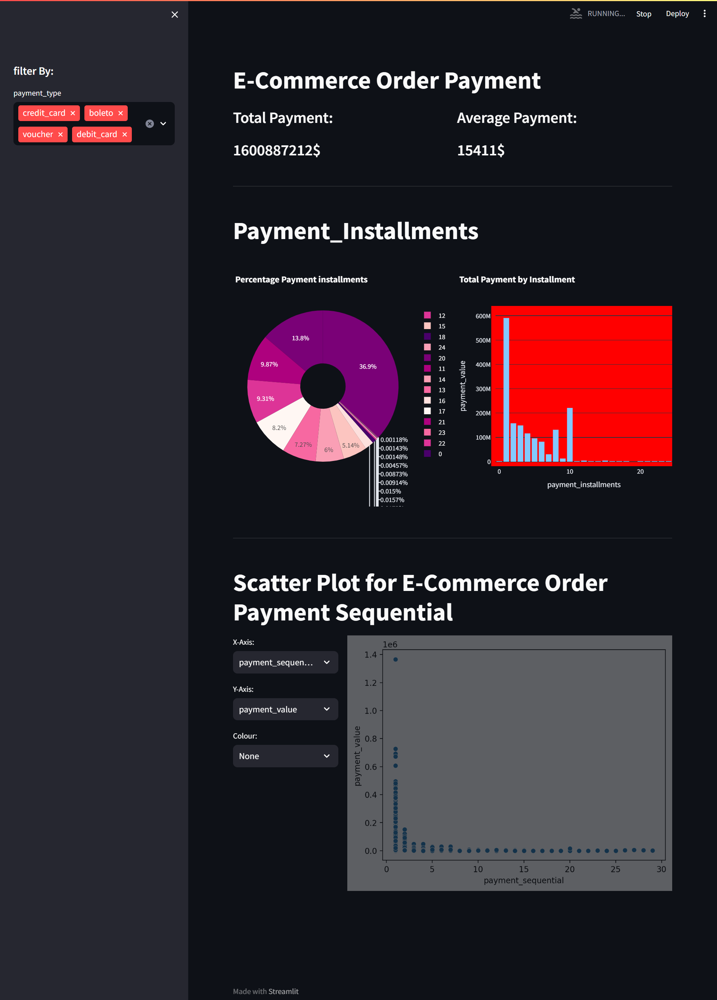

# ✨Dicoding Collection Dashboard ✨
## Setup environment
```
conda create --name main-ds python=3.9
conda activate main-ds
pip install  pandas  matplotlib seaborn jupyter streamlit plotly os
```

## Run steamlit app
```
streamlit run Dashboard.py
```


## Link local URL Dashboard.py

<http://localhost:8501/>


## Documentation





